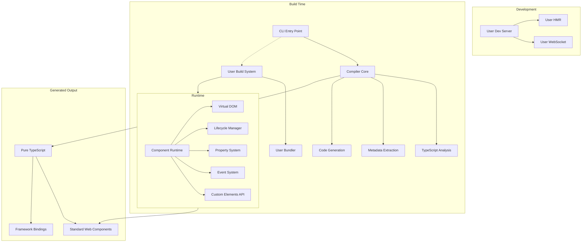
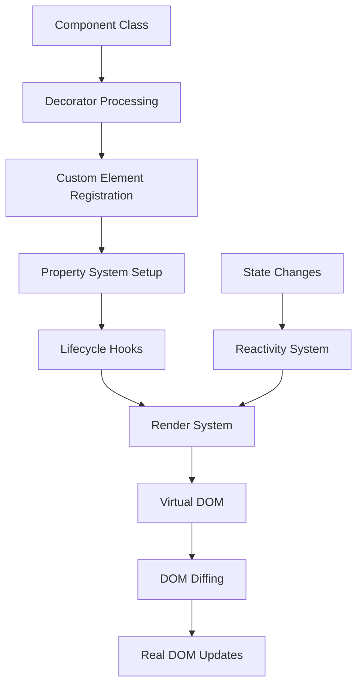
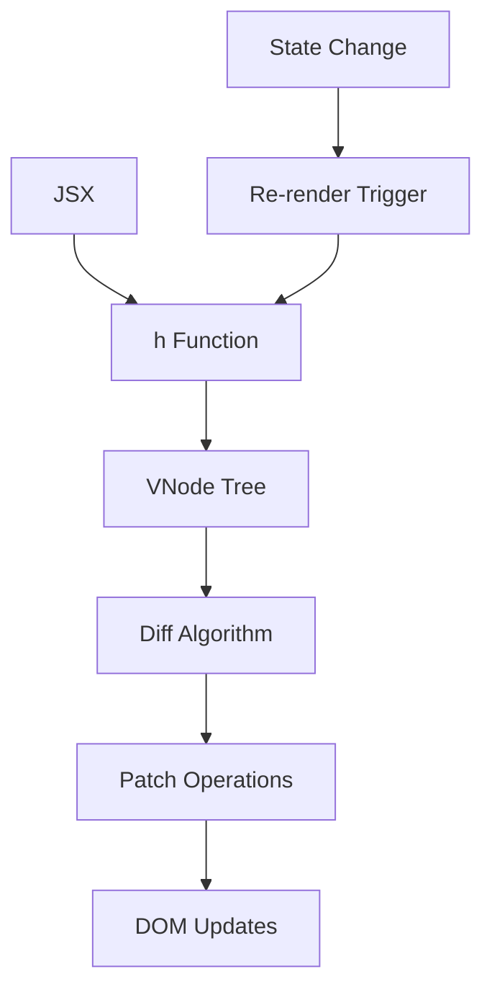

# Pencil Technical Documentation

Welcome to the Pencil technical documentation. This documentation provides comprehensive information about the internal architecture and implementation details of Pencil - a lightweight toolkit for authoring Web Components using familiar, decorator-based TypeScript syntax.

## Overview

Pencil is a build-agnostic, framework-friendly Web Component toolkit that takes a different approach from traditional compilers. Unlike tools that provide their own compilation pipeline, Pencil outputs pure TypeScript source code that integrates seamlessly with any build system.

### Architecture Overview



## Key Differences from Stencil

| Aspect | Stencil | Pencil |
|--------|---------|--------|
| **Build System** | Integrated (Rollup-based) | Bring Your Own |
| **Output** | Compiled JavaScript bundles | Pure TypeScript source |
| **Runtime** | Custom runtime (**up to ~4-7KB**, if all features are used) | Minimal runtime (~0-2KB) |
| **Polyfills** | Automatic inclusion | Not included; handled by your bundler |
| **Dev Server** | Built-in | Use any dev server |
| **Bundling** | Integrated | Use any bundler |

## Core Components

### [CLI](./packages/cli/)
**Location:** `/packages/cli`

The command-line interface that provides development tools and code generation:
- Component scaffolding and generation
- TypeScript analysis and transformation
- Framework binding generation
- Development utilities
- Build system integration helpers

### [Compiler](./packages/core/)
**Location:** `/packages/core`

The analysis and transformation engine that processes TypeScript components:
- **Analysis**: Decorator extraction and component metadata analysis
- **Resolution**: Module resolution and dependency tracking  
- **Transforms**: TypeScript AST transformations for optimization
- **CodeGen**: Framework binding and utility code generation
- **Output**: File system abstraction and output management

Key responsibilities:
- Component metadata extraction from decorators
- TypeScript source analysis
- Framework binding generation
- Build system integration
- Source-to-source transformations

### [Runtime](./packages/runtime/)
**Location:** `/packages/runtime`


The lightweight client-side library that powers Pencil components:
- **Component Lifecycle**: Custom element lifecycle management
- **Virtual DOM**: Efficient rendering and diffing
- **Property System**: Reactive property and state management
- **Event System**: Custom event handling and delegation
- **Decorators**: Runtime decorator implementations
- **JSX Runtime**: JSX transformation and rendering

Key features:
- **Maximum size:** ~4–7KB (if all features are used)
- **Tree-shakable:** Unused features are removed by your bundler of choice (Vite, Rollup, esbuild, etc.), so the actual shipped runtime is often much smaller.
- Minimal overhead (~0–2KB) for basic usage
- Standard Custom Elements API compliance
- Framework-agnostic design
- Optional runtime features

### [Utils](./packages/utils/)
**Location:** `/packages/utils`

Shared utilities used across all packages:
- Performance monitoring and profiling
- Error handling and reporting
- Logging and debugging utilities
- Type utilities and helpers
- Build system helpers

## Runtime Architecture

### Component System



#### Decorators

Pencil provides a rich set of decorators for component development:

- **@Component()**: Declares a new web component with configuration
- **@Prop()**: Declares reactive properties with attribute reflection
- **@State()**: Declares internal reactive state
- **@Event()**: Declares custom events the component can emit
- **@Listen()**: Listens for DOM events on the component or globally
- **@Element()**: Provides access to the host element (deprecated)

#### Lifecycle Hooks

Components follow a predictable lifecycle:

1. **constructor**: Element instantiation
2. **connectedCallback**: Element added to DOM
3. **componentWillLoad**: Before first render
4. **componentWillRender**: Before each render
5. **render**: Generate virtual DOM
6. **componentDidRender**: After each render
7. **componentDidLoad**: After first render
8. **componentDidUpdate**: After subsequent updates
9. **disconnectedCallback**: Element removed from DOM

### Virtual DOM Implementation



Pencil includes a lightweight virtual DOM implementation that provides:
- Efficient diffing and patching
- Key-based reconciliation
- Fragment support
- Event delegation
- Minimal memory footprint

### Property and State System

The reactivity system handles:
- Property-attribute synchronization
- Type coercion and validation
- Change detection and callbacks
- Reflection configuration
- Default value handling

### Event System

Custom event handling includes:
- Event emission with custom data
- Event delegation and bubbling
- Global event listening
- Composed event support
- Framework integration helpers

## Build Process

Unlike traditional compilers, Pencil's build process is distributed:

### 1. Analysis Phase (Optional)
- Parse TypeScript source files
- Extract component metadata
- Generate framework bindings
- Create development utilities

### 2. User Build Phase
- User's chosen build system processes TypeScript
- Standard TypeScript compilation
- User's bundler creates final output
- User's dev server provides HMR

### 3. Runtime Phase
- Pencil runtime initializes components
- Custom elements register with the browser
- Component lifecycle manages rendering
- Virtual DOM handles updates

## Output Targets

Pencil can generate various outputs:

### Standard Web Components
- Pure Custom Elements API compliance
- Framework-agnostic components
- Standard HTML attributes and properties
- Native event systems

### Framework Bindings
- React component wrappers
- Angular component integration
- Vue component bindings
- Svelte component adapters

### Development Utilities
- TypeScript type definitions
- Documentation generation
- Testing utilities
- Development helpers

## Configuration

### Project Configuration <mark>TODO</mark>

```typescript
// pencel.config.ts
import { defineConfig } from '@pencel/core';

export default defineConfig({
});
```

### Runtime Configuration <mark>TODO</mark>

```typescript
// Runtime initialization
import { pencilInit } from '@pencel/runtime';

pencilInit({
  debug: true
});
```

## Performance Characteristics

### Bundle Size
- **Runtime**: 0-2KB (optional features)
- **Components**: No overhead beyond TypeScript output
- **Polyfills**: Not included; handled by your bundler
> **Polyfills:** Pencil does not include or inject any polyfills. If your application needs them for legacy browser support, configure your bundler to add them.

### Runtime Performance
- **Virtual DOM**: Optimized diffing algorithm
- **Event System**: Delegated event handling
- **Property System**: Efficient change detection
- **Lifecycle**: Minimal overhead hooks

### Development Experience
- **Build Speed**: Depends on user's build system
- **HMR**: Integrated with user's dev server
- **TypeScript**: Full type safety and intellisense
- **Debugging**: Standard browser dev tools

## Monorepo Structure

```
pencil/
├── packages/
│   ├── cli/                    # Command line interface
│   │   ├── src/
│   │   │   ├── commands/       # CLI command implementations
│   │   │   ├── generators/     # Code generation utilities
│   │   │   └── utils/          # CLI-specific utilities
│   │   └── package.json
│   │
│   ├── core/                   # Compiler and analysis engine
│   │   ├── src/
│   │   │   ├── compiler/       # Core compilation logic
│   │   │   │   ├── analysis/   # Component analysis
│   │   │   │   ├── api/        # Public API
│   │   │   │   ├── codegen/    # Code generation
│   │   │   │   ├── core/       # Core orchestration
│   │   │   │   ├── resolution/ # Module resolution
│   │   │   │   ├── transforms/ # AST transformations
│   │   │   │   ├── types/      # Type definitions
│   │   │   │   └── utils/      # Compiler utilities
│   │   │   └── fs/             # File system abstraction
│   │   └── package.json
│   │
│   ├── runtime/                # Runtime library
│   │   ├── src/
│   │   │   ├── core/           # Core runtime features
│   │   │   │   ├── vdom/       # Virtual DOM implementation
│   │   │   │   ├── attributes.ts # Attribute handling
│   │   │   │   ├── jsx.ts      # JSX runtime
│   │   │   │   ├── scheduler.ts # Rendering scheduler
│   │   │   │   └── types.ts    # Core type definitions
│   │   │   ├── decorators/     # Decorator implementations
│   │   │   │   ├── component.ts # @Component decorator
│   │   │   │   ├── prop.ts     # @Prop decorator
│   │   │   │   ├── state.ts    # @State decorator
│   │   │   │   ├── event.ts    # @Event decorator
│   │   │   │   └── listen.ts   # @Listen decorator
│   │   │   ├── controllers/    # Component controllers
│   │   │   └── utils/          # Runtime utilities
│   │   ├── examples/           # Runtime examples
│   │   └── package.json
│   │
│   └── utils/                  # Shared utilities
│       ├── src/
│       │   ├── createPerformanceTree.ts
│       │   ├── log.ts
│       │   ├── throwError.ts
│       │   └── index.ts
│       └── package.json
│
├── example/                    # Example project
├── docs/                       # Documentation
├── nx.json                     # Nx workspace configuration
├── package.json                # Root package.json
└── tsconfig.base.json          # Base TypeScript configuration
```

## Contributing

For detailed information about contributing to Pencil, see the [Contributing Guide](./CONTRIBUTING.md).
