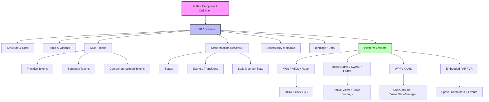

## **Universal Component IR / Spec — Big Picture**

### **Goal**

Define a **platform-agnostic component specification** that captures everything a “real” UI component” needs:

* Structure (slots, children, internal hierarchy)
* Props / variants
* Styling (tokens: primitive, semantic, component-scoped)
* Behaviour (state machine / transitions / events)
* Accessibility / semantics

This IR can be **compiled/emitted to HTML, React, WPF/XAML, SwiftUI, Android, etc.**, enabling reusable, consistent components across platforms.

---

### **Core Concepts**

1. **Component Metadata**

   * `componentName`, `slots`, `props`, `variants`, `states`, `internalStructure`, `styleTokens`, `behaviours`
2. **Style Tokens**

   * Primitive: colors, spacing, typography
   * Semantic: surface, primary, background
   * Component-scoped: `button-primary-bg`, `card-header-padding`
   * Supports theme overrides + platform-specific overrides
3. **State Machine for Behaviour**

   * Defines states (`collapsed`, `expanded`, `hovered`)
   * Defines transitions/events (`click`, `focus`)
   * Links states to styling/animation (`styleMap`)
   * Portable to XState, Zag, or platform-specific runtime
4. **Slots & Structure**

   * Named slots for children (`header`, `body`, `footer`)
   * Nested elements or internal structure defined declaratively
5. **Accessibility**

   * Semantic metadata (roles, labels) mapped per platform
6. **Bindings / Data**

   * Supports one-way/two-way reactive bindings across platforms

---

### **Platform Mapping**

* **Web/HTML:** render DOM elements, map states to CSS classes/pseudo-classes
* **React Native / Flutter / SwiftUI:** render component tree with props & state hooks, link machine transitions to UI updates
* **WPF/XAML:** generate `UserControl` + `ContentPresenter`, bind dependency properties to machine states, use VisualStateManager
* **Embedded/VR/AR:** slots mapped to spatial containers, transitions mapped to engine events

---

### **Tooling / Workflow**

1. Author **component definitions** in JSON / DSL → IR
2. Define **design tokens** (primitive, semantic, component) → resolve per target
3. **State machine** definition embedded in component → drive behaviour
4. Compile → platform-specific emitter → produce code/UI
5. Preview & test IR (web + native)
6. Maintain & version component definitions independently of platform

---

### **Ecosystem / Use Cases**

* **Design systems**: share consistent component definitions
* **Cross-platform frameworks**: unify React, WPF, SwiftUI, etc.
* **Enterprise apps / low-code platforms**: canonical components + variants
* **AI/code generation / Figma plugins**: serialize design → IR → code
* **Future platforms**: AR/VR, automotive dashboards, embedded UI

---

### **Key Benefits**

* Reusable, platform-independent components
* Single source of truth for structure, style, and behaviour
* State machines unify behaviour and style changes
* Component tokens provide theming & consistency
* Extensible to new platforms without rewriting logic

---

This is essentially a **“Universal Component Definition Language”**: a single source of truth for UI components that includes **structure, style, logic, accessibility, and state** — all portable across platforms.

