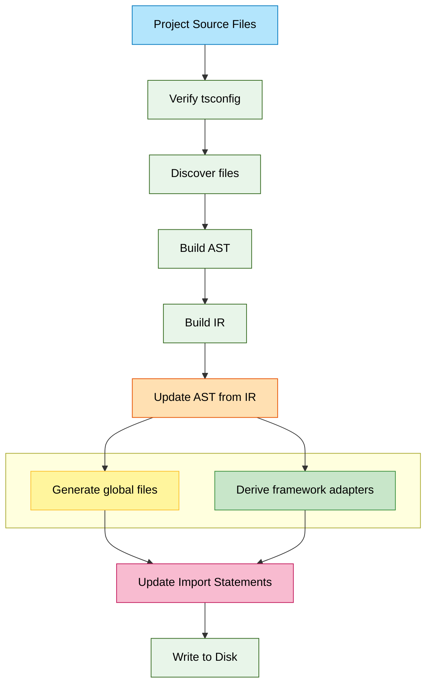

Pencel is designed to be build-agnostic and framework-friendly, taking a different approach from traditional Web Component compilers.

## Compilation Pipeline

The compiler transforms project source files through a streamlined process:

**Key phases:**
1. **Verify & Discover**: Check config, find source files
2. **Build AST**: Create `ts.SourceFiles` registry
3. **Build IR**: Extract component metadata into immutable IR
4. **Update AST**: Sync AST nodes using IRRef (from IR state)
5. **Generate & Derive**: Create global files and framework adapters
6. **Merge**: Resolve imports, update file references
7. **Write**: Flush to disk

## Key Concepts

- **Project Source Files**: User-written `.pen.tsx` files
- **IR (Intermediate Representation)**: Immutable object graph of the component system
- **Generators**: Global output files (no 1:1 mapping), always fully rebuilt
- **Derivatives**: Framework adapters (1:1 per source file)
- **AST Sync**: Makes sure the AST is consistent with the computed IR before printing
