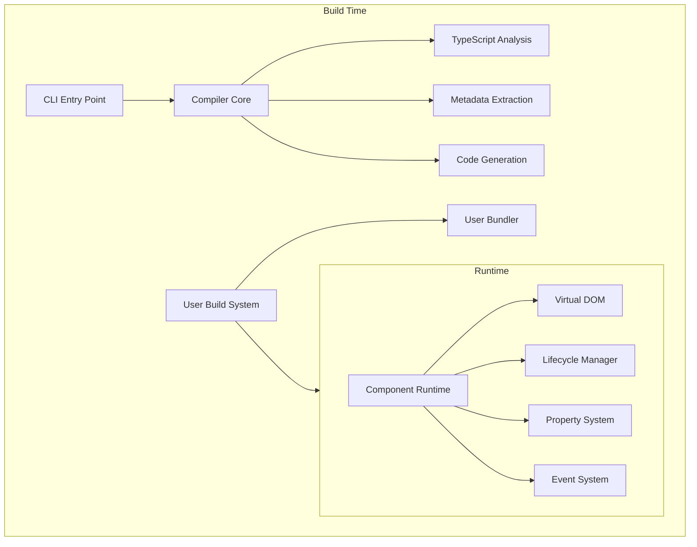

Pencel is designed to be build-agnostic and framework-friendly, taking a different approach from traditional Web Component compilers.

## Build Process & Runtime

## Key Differences from Other Tools

Unlike traditional compilers that provide their own compilation pipeline, Pencel:

- Works with any build system
- Outputs pure TypeScript source code
- No enforced bundler or dev server
- No automatic polyfills
