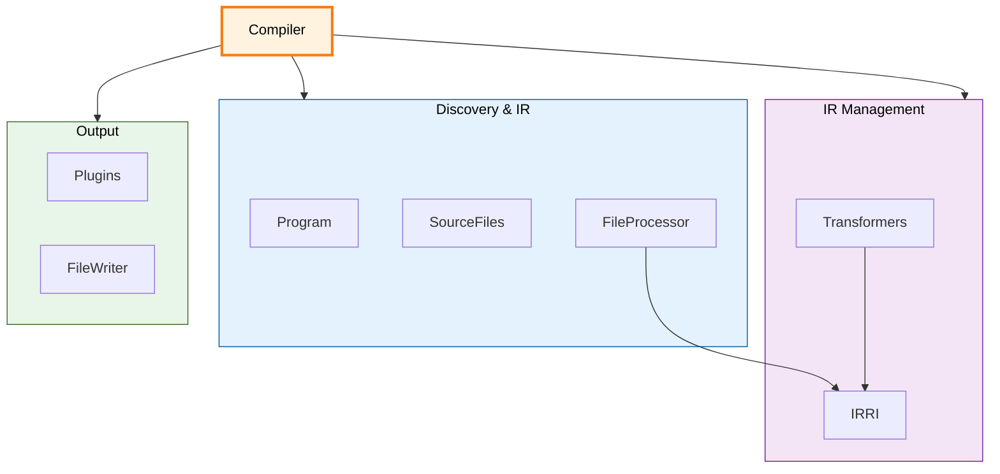

The compiler orchestrates through a set of interdependent services. See [Architecture Overview](/pencel/internals/architecture/) for pipeline phases.

## System Architecture



## Component Reference

| Component | Purpose |
|-----------|---------|
| **Program** | Validate tsconfig.json, glob input files |
| **SourceFiles** | Registry for source and generated files |
| **FileProcessor** | Build IR for one file |
| **IRRI** | Collect and query all IRefs by kind |
| **Transformers** | Sync AST nodes from IR state |
| **Plugins** | Run generators and derivatives |
| **FileWriter** | Preprocess, print, write all files |
| **Compiler** | Orchestrate pipeline |

## Compilation Loop

```ts
class Compiler {
  async compile(): Promise<Map<string, FileIR>> {
    await this.#program.discover()
    await this.#sourceFiles.loadSource()
    this.#sourceFiles.clearGenerated()
    
    const irs = new Map<string, FileIR>()
    for (const sourceFile of this.#sourceFiles.getAll().values()) {
      const ir = await this.#fileProcessor.process(sourceFile)
      if (ir) irs.set(sourceFile.fileName, ir)
    }
    
    await this.#plugins.runGenerators(irs)
    await this.#plugins.runDerivatives(irs)
    await this.#fileWriter.writeEverything()
    
    return irs
  }
}
```

## Key Details

**Program** – Discovers and validates input. See [Compilation Phases](/pencel/internals/compilation/).

**SourceFiles** – Central registry. See [File Management](/pencel/internals/file-management/).

**FileProcessor** – Builds FileIR for one source file, dispatches to transformers.

**IRRI** – Tracks all IRefs by kind. See [IRRI & IRRef](/pencel/internals/irri/).

**Transformers** – Update AST from IR state. Examples: ComponentTransformer, PropertyTransformer.

**Plugins** – Listen via `handle()` method. Generators create global files; derivatives create per-file adapters.

**FileWriter** – Single pass: preprocess → print → postprocess → write. See [Symbol Resolution](/pencel/internals/preprocessing/).

All services use [Dependency Injection](/pencel/internals/dependency-injection/) for singleton pattern and automatic wiring.
