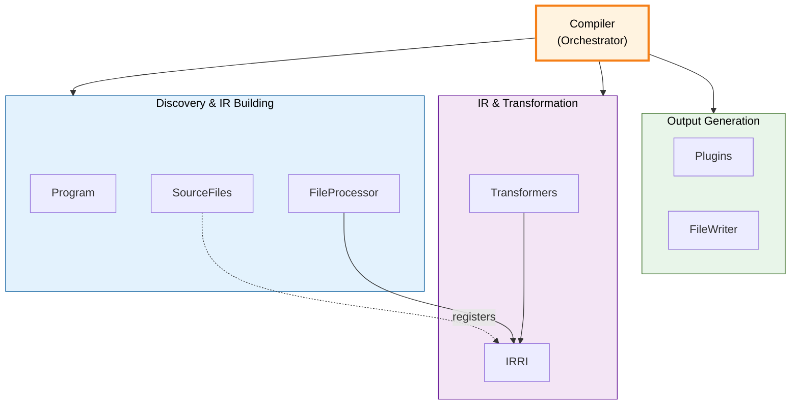
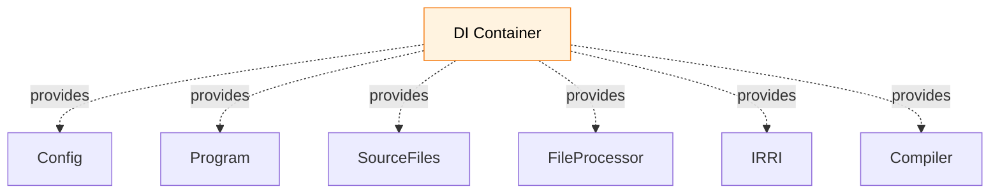

The core compiler system and how the pieces fit together. See [Compilation System](/pencel/internals/compilation/) for the pipeline overview.

## System Architecture



## Key Components

### Program

Discovers input files and validates `tsconfig.json`.

- Validates TypeScript configuration
- Globs for input files based on config pattern
- Provides parsed `tsconfig` for compiler setup

### SourceFiles

Manages all source and generated files, maintains their separation, and serves as the central registry.

- Maintains `#sourceFiles` (project inputs) separately from `#generatedFiles`
- Provides API for creating generated files (auto-registers them)
- Manages import resolution and dependency validation
- Indexes symbols across user, generated, and derived files

See [File and Dependency Management](/pencel/internals/file-management/) for detailed information.

### FileProcessor

Builds the IR for a single source file.

- Creates `FileIR` for the source file
- Runs `FileTransformer` to sync AST
- Calls plugins for codegen hooks

### IRRI

Tracks all IR nodes created during a compilation pass, organized by kind.

- Collects all IRs as they're created via auto-registration from `IRRef`
- Organizes by IR kind (Component, Property, Event, etc.)
- Provides typed queries for batching transformations
- Implodes references to get pure IR tree for generation

See [IRRI and IRRef](/pencel/internals/irri/) for pairing and querying strategy.

### Transformers

Sync AST nodes to reflect their IR state. Internal infrastructure, not exposed as plugins.

Examples: `ComponentTransformer`, `PropertyTransformer`

Called on all IRs of a given kind, batched via `IRRI`.

### FileWriter

Flushes generated and derived files to disk.

- Writes all files in `SourceFiles.getAll()`
- Handles file system I/O

## Compilation Flow

The `Compiler` orchestrates the entire pipeline:

```typescript
async compile(): Promise<Map<string, FileIR>> {
  await this.#program.discover()
  await this.#sourceFiles.loadSource()
  this.#sourceFiles.clearGenerated()
  
  // 3. Build IR for all sources
  const irs = new Map<string, FileIR>()
  for (const sourceFile of this.#sourceFiles.getAll().values()) {
    const ir = await this.#fileProcessor.process(sourceFile)
    if (ir) irs.set(sourceFile.fileName, ir)
  }
  
  // 4-6. Sync AST, Generate, Derive
  await this.#plugins.runGenerators(irs)
  await this.#plugins.runDerivatives(irs, this.#changedSourceFiles)
  
  // 7. Write to disk
  await this.#fileWriter.writeEverything()
  
  return irs
}
```

## Dependency Injection

All core components use constructor injection from a DI container:



This enables:
- Singleton pattern: one instance per compilation
- Clear dependency graph
