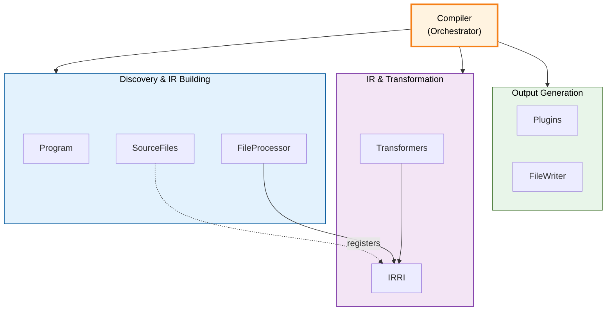

The core compiler system and how the pieces fit together. See [Architecture](/pencel/internals/architecture/) for the pipeline overview.

## System Architecture



## Key Components

### Program

Discovers input files and validates `tsconfig.json`.

- Validates TypeScript configuration
- Globs for input files based on config pattern
- Provides parsed `tsconfig` for compiler setup

### SourceFiles

Manages all source and generated files, maintains separation, and provides a central registry.

- Maintains `#sourceFiles` separately from `#generatedFiles`
- Provides API for creating generated files (auto-registers)
- Manages import resolution

See [File and Dependency Management](/pencel/internals/file-management/) for details.

### FileProcessor

Builds the IR for a single source file.

- Creates `FileIR` for the source file
- Runs `FileTransformer` to sync AST
- Calls plugins for codegen hooks

### IRRI

Tracks all IR nodes created during compilation, organized by kind. Enables efficient batch transformations.

See [IRRI and IRRef](/pencel/internals/irri/) for details on pairing IR with AST nodes.

### Transformers

Sync AST nodes to reflect their IR state. Internal infrastructure, not exposed as plugins.

Examples: `ComponentTransformer`, `PropertyTransformer`

Called on all IRs of a given kind, batched via `IRRI`.

### FileWriter

Flushes generated and derived files to disk.

- Writes all files in `SourceFiles.getAll()`
- Handles file system I/O

## Compilation Flow

The `Compiler` orchestrates the pipeline:

```ts
class Compiler {
  async compile(): Promise<Map<string, FileIR>> {
    await this.#program.discover()
    await this.#sourceFiles.loadSource()
    this.#sourceFiles.clearGenerated()
    
    const irs = new Map<string, FileIR>()
    for (const sourceFile of this.#sourceFiles.getAll().values()) {
      const ir = await this.#fileProcessor.process(sourceFile)
      if (ir) irs.set(sourceFile.fileName, ir)
    }
    
    await this.#plugins.runGenerators(irs)
    await this.#plugins.runDerivatives(irs, this.#changedSourceFiles)
    await this.#fileWriter.writeEverything()
    
    return irs
  }
}
```

## Dependency Injection

All core components use a lightweight DI container to retrieve their dependencies. This enables singleton pattern, automatic wiring, and circular dependency detection.

See [Dependency Injection](/pencel/internals/dependency-injection/) for details on the DI system and its usage.

## Plugin Hooks

Plugins listen for hooks using the `handle()` method:

- **`generate`** – Create global files from complete IR (always fully rebuild)
- **`derive`** – Create framework adapters (per-source, incremental)
