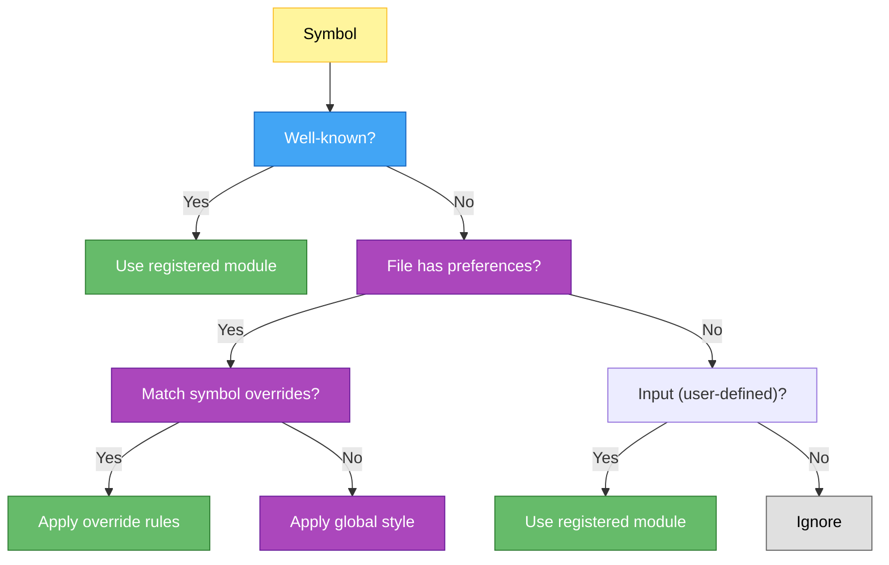

import { Aside } from '@astrojs/starlight/components';

Preprocessing automatically collects symbol references and injects missing imports before writing files to disk.

## The Problem

Generated code references `sp()`, `dce()`, `mc()`, `INTERNALS` without importing them. Preprocessing ensures all symbols are imported before files are written.

Additionally, barrel files (files that only re-export symbols) should not have imports added for the re-exported symbols, since they're being re-exported, not used as references.

## Architecture

Single universal processor works for all files:

```typescript
class SourcePreprocessor {
  process(sourceFile: SourceFile): SourceFile {
    const usedSymbols = collector.collect(sourceFile)      // Find all identifiers
    const requirements = builder.build(usedSymbols)        // Lookup modules
    return injector.injectImports(sourceFile, requirements) // Inject AST
  }
}
```

Three-bucket registry (well-known + project symbols + file symbols) means same processor handles all symbol types.

## Components

| Component | Purpose |
|-----------|---------|
| **SymbolRegistry** | Symbol → module mapping; well-known + project + file symbol buckets |
| **SymbolCollector** | AST walk to find identifiers; filters declarations, imports, exports, and built-ins |
| **ImportBuilder** | Convert symbols to requirements; group, deduplicate |
| **ImportInjector** | Add/merge imports into AST using ts.factory |
| **SourcePreprocessor** | Orchestrate: collect → build → inject |

### SymbolCollector Details

The collector performs a three-phase symbol collection process:

1. **Pre-extraction phase** – Before traversing the AST, it pre-extracts:
   - Symbols from import specifiers (e.g., `import { Symbol }`)
   - Symbols from export specifiers (e.g., `export { Symbol }`)
   - These symbols are skipped during collection to prevent them from being treated as missing references

2. **Import extraction phase** – Collects symbols that are already imported via import declarations

3. **Main traversal phase** – Walks the AST collecting identifier references, filtering out:
   - Already-imported symbols
   - Export/import specifier symbols
   - Built-in globals (`Promise`, `Array`, `console`, etc.)
   - Local declarations (variables, functions, classes, parameters, properties)

<Aside type="note">
**Why pre-extract export/import specifiers?** Factory-created AST nodes don't automatically have parent pointers set. Pre-extraction avoids the fragile parent pointer check and ensures barrel files (pure re-export files) remain clean without unnecessary imports added for re-exported symbols.
</Aside>

<Aside type="tip">
**Barrel files are automatically clean.** If a file contains only `export { Symbol } from "./module"` statements, the preprocessor correctly identifies that these are not reference symbols needing imports—they're being re-exported. No import statements are added.
</Aside>

## Integration

Runs in `FileWriter.writeAllFiles()` before printing:

```typescript
for (const sourceFile of files.values()) {
  const preprocessed = sourcePreprocessor.process(sourceFile)
  
  const printed = sourcePrinter.printFile(preprocessed)
  await writeFile(outputPath, printed)
}
```

## Symbol Buckets

The registry maintains three separate buckets for different symbol types:

### Well-Known Symbols

Stable APIs registered by Pencel and plugins that are always available during symbol resolution. Well-known symbols represent dependencies that **should be imported regardless of where code appears** (generated files, derived files, or custom plugin outputs).

Example well-known symbols from Pencel runtime:

```typescript
sp, dce, dctn, sc, st, ael, mc     // Runtime DOM operations
INTERNALS, cacheSymbol, eventListenersSymbol  // Runtime metadata
```

Registered on startup via `SymbolRegistry#registerRuntimeSymbols()` and plugin initialization. Once registered, well-known symbols never change during a compilation pass.

**Intent:** Well-known symbols decouple imports from file location. A plugin generating Angular code can register Angular symbols as well-known, ensuring all outputs—whether generated components, derived adapters, or barrel files—automatically import from `@angular/core`. This keeps the preprocessing logic uniform across all output targets.

### Project Symbols

Discovered from generated `.gen.ts` files (component classes, etc.):

```typescript
TestFeatures, PenCardElement, PenInputElement  // Component classes
```

Registered via `registerInputSymbol()` as symbols are discovered. Configurable per plugin via `ImportPreference`:

```typescript
preference.style === "package"
  ? { symbol: "MyComp", module: "@org/components" }
  : { symbol: "MyComp", module: "./my-comp.gen" }
```

### File Symbols

Cached mapping of which symbols were exported from each file:

```typescript
this.#fileSymbols: Map<filePath, Set<symbolNames>>
```

Used for incremental updates and rescanning when files change. Enables `upsertFileSymbols()` to track and update project symbols efficiently.

## Deduplication

Imports from same module are consolidated:

```typescript
// Before preprocessing
import { State } from "@pencel/runtime";
export class Comp {
  render() {
    sp(el, props);    // Uses sp, dce
    dce("div");
  }
}

// After preprocessing
import { State, sp, dce } from "@pencel/runtime";
export class Comp {
  render() {
    sp(el, props);
    dce("div");
  }
}
```

Existing imports are preserved; only missing symbols are added.

<Aside type="caution">
**Identifier collection is broad.** The collector captures ALL identifiers in the code, including those in property access chains (`obj.method`), decorators, and type annotations. The `ImportBuilder` filters these through the registry—if a symbol isn't registered, it's silently ignored. This is intentional: only well-known symbols and registered user symbols get imports added.
</Aside>

## Plugin Registration

See [Plugin System](/docs/internals/plugins/) for details on how plugins register and control symbols.

Plugins register symbols during initialization:

```typescript
this.#registry.registerWellKnown([
  { symbol: "myHelper", module: "@my-org/helpers" }
]);
```

## Import Preferences

Plugins can control how symbols are imported in specific files using `ImportPreference`. See [Plugin System - File Creation with Preferences](/docs/internals/plugins/#file-creation-with-preferences) for complete examples.

**Quick reference:**

```typescript
const preference: ImportPreference = {
  style: "package",           // "package" | "relative" | "deep"
  packageName: "@my/lib",     // for "package" style
  symbolOverrides: [
    { match: "Component1", packageName: "@other/lib" },
    { match: "*Helper", style: "relative" },
  ],
};

this.#sourceFiles.newFile(fileName, statements, { preference });
```

During preprocessing, preferences control the import resolution:

1. **Well-Known symbols** – Always use their registered module
2. **Symbol overrides** – Apply pattern-matched rules if present
3. **Global style** – Fall back to file's default preference

## Performance

- **Collection** – Linear AST walk per file
- **Registry lookup** – O(1) hash table, pattern matching on symbol overrides
- **Injection** – Single AST pass
- **Total** – Typically less than 1ms per file

## Symbol Lookup Decision Tree



