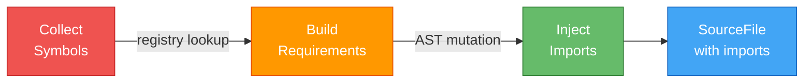
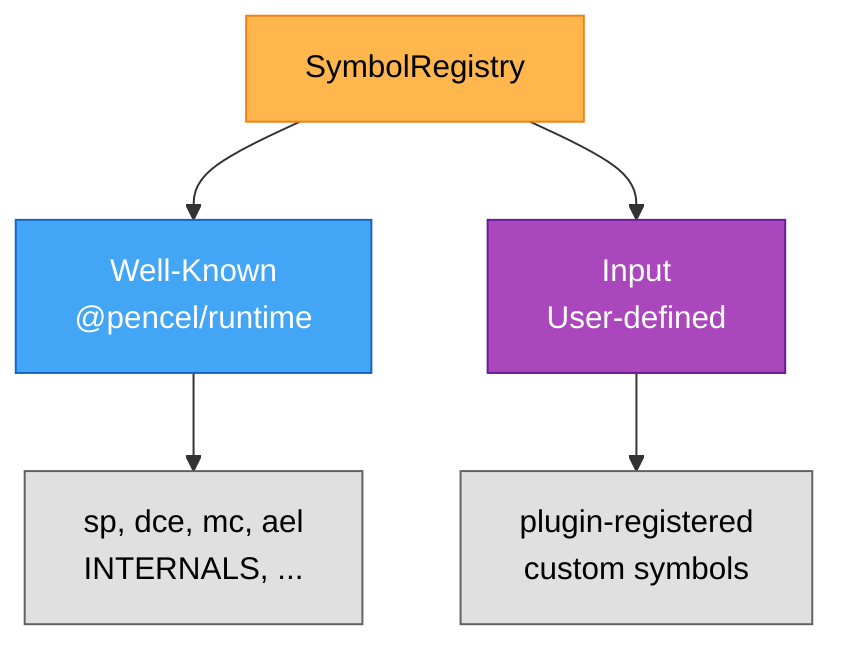
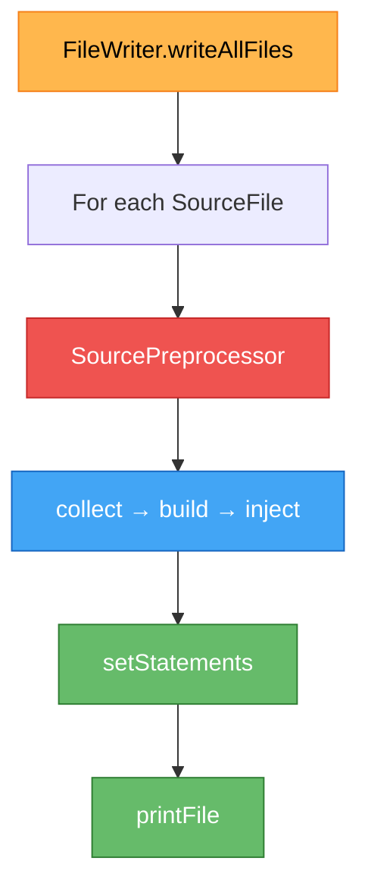
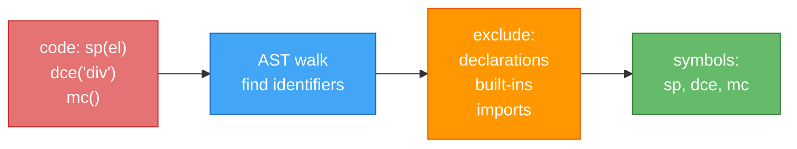
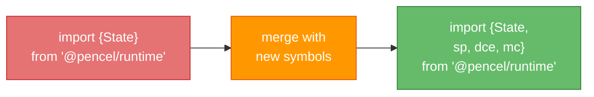

Visual reference for the symbol preprocessing system.

## Core Pipeline (Simplified)

## Two-Bucket Registry

## FileWriter Integration

## Symbol Collection Example

## Import Injection Example

