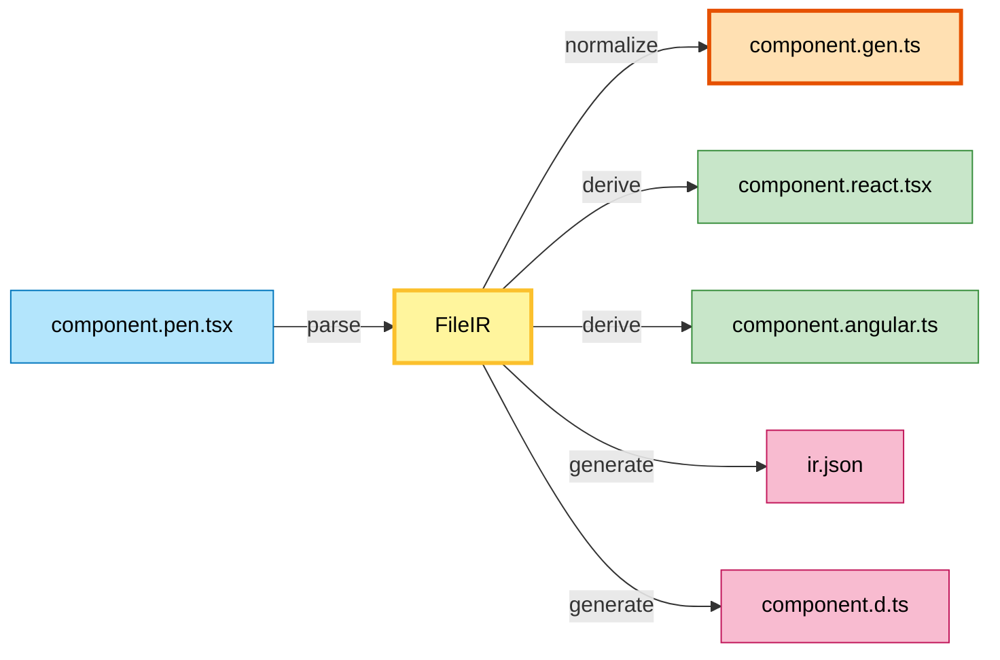

A conceptual overview of how Pencel transforms component source files into framework-specific outputs.

**⚠️ Note:** This describes intended architecture. See [TODOs](/pencel/internals/todos/) for implementation status.

## The Core Insight

Pencel translates user intent into multiple output formats. A single `.pen.tsx` component should work in React, Angular, Vue, or vanilla JS—all from one source.

**Challenge:** Generate framework code efficiently while keeping the semantic model clean.  
**Answer:** Separate concerns into layers.

## Three Layers

### 1. Semantic Layer (The IR)

The Intermediate Representation is a complete, immutable snapshot of what the user wrote:

```tsx
// components/my-button.pen.tsx
@Component({ tag: 'my-button' })
export class MyButton {
  @Prop() label: string
  @Event() onClick: EventEmitter<void>
  render() { ... }
}
```

Parsed into immutable IR:

```typescript
{
  tag: 'my-button',
  props: [{ name: 'label', type: 'string' }],
  events: [{ name: 'onClick' }]
}
```

**Format-agnostic.** Just "here's what the user wrote."

### 2. Synchronization Layer (AST Syncing)

Before outputting anything, ensure all AST nodes sync with IR. Each IR pairs with its AST node via [IRRef](/pencel/internals/irri/). **Transformers** use IR as single source of truth to update AST.

Sync means:
- Update decorator metadata to match IR state
- Fix property initializers
- Extend the user's implementation as needed

See [IRRI and IRRef](/pencel/internals/irri/) for details.

### 3. Translation Layer (Generate & Derive)

Two types of outputs:

**Generators** (Global)
- Create project-level files
- Always fully rebuild
- Examples: `ir.json`, `component.d.ts`, schemas
- Stateless: consume full IR every time

**Derivatives** (Per-Source)
- Create framework-specific wrappers
- Only regenerate when source changed
- Examples: `component.react.tsx`, `component.angular.ts`
- Can access full IR, but output maps 1:1 to user source

That's it. No need to think about the entire pipeline.

## Mental Model

Think of Pencel as a **component translation engine**:



**`.gen.ts`** is the "normalized" source: inlined CSS, resolved URLs, extended implementation. Other derivatives (React, Angular) are further transformations.

## File Management

As files are generated/derived, Pencel manages imports and dependencies via **SourceFiles class**. See [File and Dependency Management](/pencel/internals/file-management/) for details.
