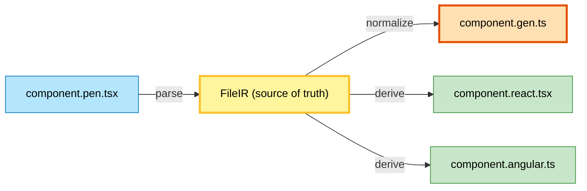

## The Problem

One `.pen.tsx` component needs to work in React, Angular, Vue, and vanilla JS. Pencel separates concerns into three layers to achieve this efficiently.

## Layer 1: Semantic (IR)

Format-agnostic metadata captured from decorators:

```typescript
{
  tag: 'my-button',
  props: [{ name: 'label', type: 'string' }],
  events: [{ name: 'onClick' }]
}
```

This IR is the single source of truth for all downstream transformations.

## Layer 2: Synchronization (AST)

Transformers sync AST nodes with IR via [IRRef](/pencel/internals/irri/). IR drives all changes; AST mirrors the result.

## Layer 3: Translation (Output)

Two kinds of output from IR:

- **Generators** – Global files (ir.json, components.d.ts). Fully rebuild from complete IR each pass.
- **Derivatives** – Framework adapters (React, Angular, Vue). One per source file, incremental.

## Mental Model



**Key:** `.gen.ts` is the normalized source (inlined CSS, resolved URLs, extended impl). Derivatives wrap `.gen.ts` for each framework.
