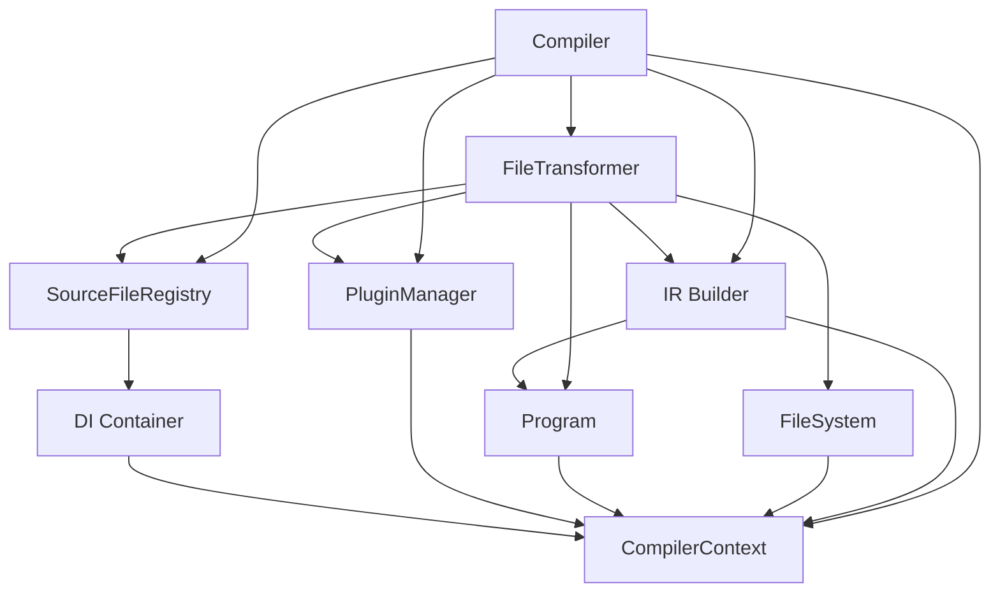

```mermaid
graph TD
    %% Core Foundation
    Context[CompilerContext]
    Container[DI Container]
    
    %% Plugin System (Independent)
    PluginManager[PluginManager]
    
    %% Core Services
    Program[Program]
    FileSystem[FileSystem]
    Registry[SourceFileRegistry]
    
    %% IR Layer (Intermediate Representation)
    IRBuilder[IR Builder]
    
    %% Processing Pipeline
    Transformer[FileTransformer]
    
    %% Top Level Orchestrator
    Compiler[Compiler]
    
    %% Simple Dependencies
    Container --> Context
    
    PluginManager --> Context
    
    Program --> Context
    FileSystem --> Context
    Registry --> Container
    
    IRBuilder --> Context
    IRBuilder --> Program
    
    Transformer --> Program
    Transformer --> FileSystem
    Transformer --> Registry
    Transformer --> PluginManager
    Transformer --> IRBuilder
    
    Compiler --> Context
    Compiler --> PluginManager
    Compiler --> Transformer
    Compiler --> Registry
    Compiler --> IRBuilder
```